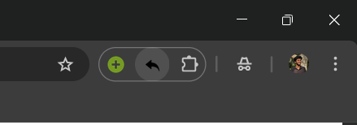
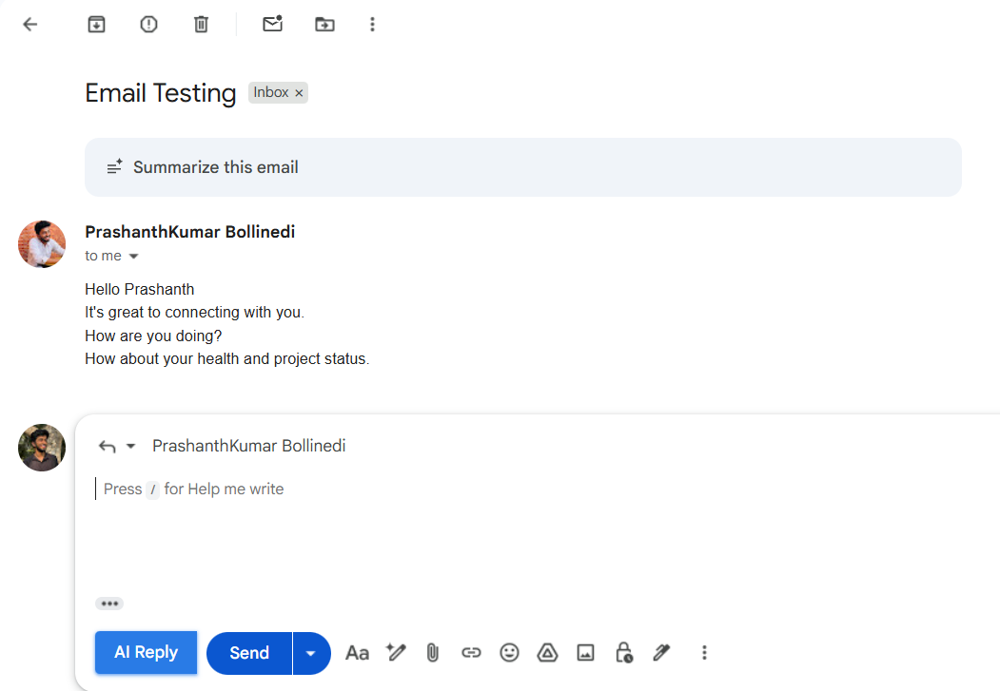
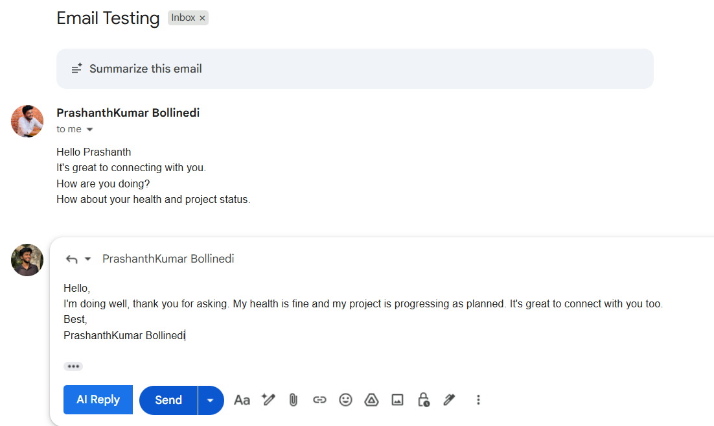
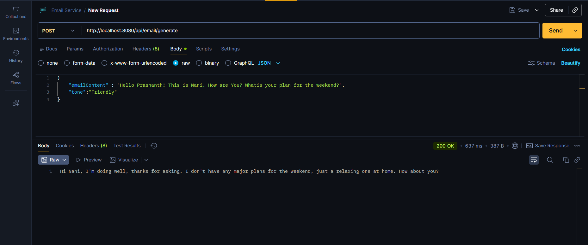

# Smart Email Writer 📧✨

An AI-powered email reply generator that seamlessly integrates with Gmail to help you compose professional email responses effortlessly. This application leverages Groq's LLaMA 3.3 70B model to generate contextual, professional email replies directly within your Gmail interface.

## 🌟 Features

- **AI-Powered Email Generation**: Leverages Groq's LLaMA 3.3 70B model for intelligent email composition
- **Gmail Integration**: Chrome extension that seamlessly integrates with Gmail
- **React Frontend**: Modern, responsive user interface built with React and Material-UI
- **Spring Boot Backend**: Robust Java backend API for email generation
- **Customizable Tone**: Generate emails with different tones and contexts
- **Real-time Generation**: Fast response times for instant email suggestions

## 🏗️ Architecture

This project consists of three main components:

1. **Backend** - Spring Boot REST API (Java 21)
2. **Frontend** - React + Vite application
3. **Browser Extension** - Chrome extension for Gmail integration

### Technology Stack

#### Backend
- Java 21
- Spring Boot 4.0.1
- Spring WebFlux (WebClient)
- Maven
- Groq API Integration

#### Frontend
- React 19.2.0
- Vite
- Material-UI (MUI)
- Axios
- ESLint

#### Extension
- Manifest V3
- Vanilla JavaScript
- CSS3

## 📁 Project Structure

```
Smart-Email-Writer/
├── backend/                    # Spring Boot application
│   ├── src/
│   │   ├── main/
│   │   │   ├── java/com/email/writer/
│   │   │   │   ├── EmailWriterApplication.java
│   │   │   │   ├── config/
│   │   │   │   │   └── WebClientConfig.java
│   │   │   │   ├── controller/
│   │   │   │   │   └── EmailGeneratorController.java
│   │   │   │   ├── model/
│   │   │   │   │   └── EmailRequest.java
│   │   │   │   └── service/
│   │   │   │       └── EmailGeneratorService.java
│   │   │   └── resources/
│   │   │       ├── application.properties
│   │   │       └── templates/
│   │   └── test/
│   └── pom.xml
├── frontend/                   # React application
│   ├── src/
│   │   ├── App.jsx
│   │   ├── main.jsx
│   │   └── assets/
│   ├── public/
│   ├── index.html
│   ├── package.json
│   └── vite.config.js
└── email-writer-extension/    # Chrome extension
    ├── manifest.json
    ├── content.js
    └── content.css
```


## 🚀 Getting Started

### Prerequisites

- Java 21 or higher
- Node.js 16+ and npm
- Maven 3.6+
- Groq API Key ([Get it here](https://groq.com))
- Chrome/Edge browser (for extension)

### Environment Variables

Create environment variables or update `application.properties`:

```properties
GROQ_URL=https://api.groq.com/openai/v1/chat/completions
GROQ_KEY=your_groq_api_key_here
```

### Installation

#### 1. Backend Setup

```bash
cd backend

# Set environment variables (Windows PowerShell)
$env:GROQ_URL="https://api.groq.com/openai/v1/chat/completions"
$env:GROQ_KEY="your_groq_api_key_here"

# Build and run
mvn clean install
mvn spring-boot:run
```

The backend will start on `http://localhost:8080`

#### 2. Frontend Setup

```bash
cd frontend

# Install dependencies
npm install

# Run development server
npm run dev
```

The frontend will start on `http://localhost:5173` (or the port Vite assigns)

#### 3. Browser Extension Setup

1. Open Chrome/Edge browser
2. Navigate to `chrome://extensions/` or `edge://extensions/`
3. Enable "Developer mode"
4. Click "Load unpacked"
5. Select the `email-writer-extension` folder
6. The extension will be added to your browser

<!-- Add extension icon in browser toolbar image here -->


## 📖 Usage

### Using the Frontend Application

1. Open the frontend application in your browser
2. Enter the email content you want to reply to
3. Specify the context or tone (optional)
4. Click "Generate" to get AI-powered email suggestions

### Using the Gmail Extension

1. Open Gmail in your Chrome/Edge browser
2. Open any email thread
3. Look for the "Generate Reply" button injected by the extension

<!-- Add Gmail button image here -->


4. Click the button to generate a contextual reply

<!-- Add generated output image here -->


## 🔌 API Documentation

### Generate Email Endpoint

**Endpoint:** `POST /api/email/generate`

**Request Body:**
```json
{
  "emailContent": "Original email content here",
  "context": "Optional context or tone specification"
}
```

**Response:**
```json
{
  "generatedReply": "AI-generated professional email response"
}
```

**Example using cURL:**
```bash
curl -X POST http://localhost:8080/api/email/generate \
  -H "Content-Type: application/json" \
  -d '{
    "emailContent": "Thank you for your interest in our product.",
    "context": "professional and friendly"
  }'
```



## 🧪 Testing

### Backend Tests

```bash
cd backend
mvn test
```

### Frontend Tests

```bash
cd frontend
npm run lint
```

## 🔧 Configuration

### Backend Configuration

Edit `backend/src/main/resources/application.properties`:

```properties
spring.application.name=email-writer
groq.api.url=${GROQ_URL}
groq.api.key=${GROQ_KEY}
```

### CORS Configuration

The API is configured to accept requests from any origin (`@CrossOrigin(origins = "*")`). For production, update this in [EmailGeneratorController.java](backend/src/main/java/com/email/writer/controller/EmailGeneratorController.java) to only allow specific domains.

### Extension Permissions

The extension requires the following permissions (configured in `manifest.json`):
- `activeTab` - To interact with the current Gmail tab
- `storage` - To store user preferences
- Host permissions for `http://localhost:8080/*` and `*://mail.google.com/*`

## 🐛 Troubleshooting

### Backend Issues

**Problem:** Application fails to start
- **Solution:** Ensure Java 21 is installed and GROQ_KEY environment variable is set

**Problem:** API returns 401 Unauthorized
- **Solution:** Verify your Groq API key is valid and correctly set

### Frontend Issues

**Problem:** Cannot connect to backend
- **Solution:** Ensure backend is running on port 8080 and CORS is properly configured

### Extension Issues

**Problem:** Button not appearing in Gmail
- **Solution:** Ensure the extension is loaded and Gmail page is refreshed

**Problem:** Extension cannot connect to backend
- **Solution:** Verify backend is running on `localhost:8080` and check browser console for errors

## 🚢 Deployment

### Backend Deployment

For production deployment, consider:
1. Setting environment variables securely
2. Using a production-grade database if needed
3. Implementing rate limiting
4. Setting up proper CORS policies
5. Using HTTPS

### Frontend Deployment

```bash
cd frontend
npm run build
```

Deploy the `dist` folder to your hosting service (Vercel, Netlify, etc.)

### Extension Distribution

To publish the extension:
1. Create a developer account on Chrome Web Store
2. Package the extension folder
3. Submit for review

## 📝 Future Enhancements

- [ ] Support for multiple AI models
- [ ] Email template library
- [ ] Multi-language support
- [ ] Email sentiment analysis
- [ ] Scheduled email suggestions
- [ ] Integration with other email providers (Outlook, Yahoo)
- [ ] Advanced customization options
- [ ] Usage analytics dashboard

## 🤝 Contributing

Contributions are welcome! Please feel free to submit a Pull Request.

1. Fork the repository
2. Create your feature branch (`git checkout -b feature/AmazingFeature`)
3. Commit your changes (`git commit -m 'Add some AmazingFeature'`)
4. Push to the branch (`git push origin feature/AmazingFeature`)
5. Open a Pull Request

## 📄 License

This project is open source and available under the MIT License.

## 👥 Authors

- Prashanth Kumar - Initial work

## 🙏 Acknowledgments

- Groq for providing the AI API
- Spring Boot team for the excellent framework
- React and Vite teams for the modern frontend tools
- Material-UI for the beautiful component library

## 📞 Support

For support, email prashanthbollinedi2910@gmail.com or open an issue in the repository.

---

**Note:** Remember to keep your API keys secure and never commit them to version control!
